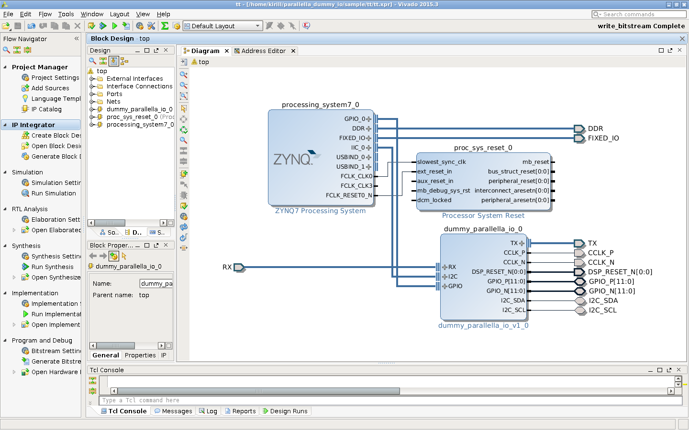

# Introduction

This repository provides a minimal Vivado project for FPGA
development on Parallella board.

Parallella board is an "18-core credit card sized computer". Read more
about it [here](http://www.parallella.org/board/). The board has a
16-core Epiphany processor and a 2-core Zynq-7000 CPU+FPGA combo. The
two are connected via FPGA fabric. FPGA code needed for that
interconnect is developed in the open
[https://github.com/parallella/parallella-hw/](https://github.com/parallella/parallella-hw/)

Minimal project does not include eLink interface needed to communicate
with the Epiphany chip. It only contains I2C block to setup power
controllers for Epiphany chip and GPIO pass-through block. So Epiphany
will not be usable if you use this project as basis for your design,
but on a plus side you will get much quicker synthesis times. The idea
is that you can iterate on your design faster and then integrate it
with the rest of the system.

# How to use

This was developed with Vivado 2015.4. Scripts might work with other
versions also, but this is not guaranteed.

## Manually

Folder `ip_repo` contains IP module called "dummy_parallella_io", you
connect I2C and GPIO interfaces to Zynq and the rest make external. If
you are targeting 7010 based board you have to change num GPIO pair to
12 in the "Customize block..." dialog.

Don't forget to also include constraints files supplied by
Adapteva. See `constraints` folder.

## Generate project with scripts

Folder `sample` contains instructions for generating a sample
project. See readme in that folder for more detail:

    source ${PathToXilinxSettingsFile}
    cd sample
    ../scripts/gen_project.sh --name test1 --7010
    ../scripts/gen_project.sh --name test2 --7020

# LICENSE

This project uses files from Adapteva that were licensed under GPL. I
do think they are working on MIT based version right now, so it should
be possible to update to that in the future.