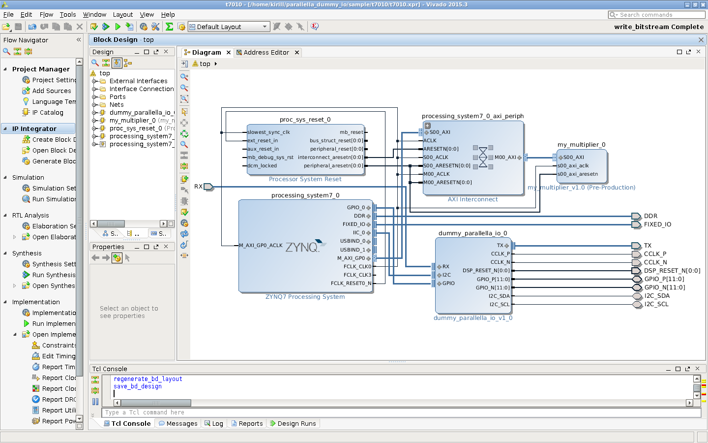

# Introduction

This project will walk you through creating a custom, minimal FPGA
design in Vivado for Parallella board. This was tested using
Parallella "Desktop Edition" (7010 based), but the scripts also
support "Embedded" edition (7020 based), in fact scripts default to
7020 based model.

We will create a simple multiplier circuit that is accessible via
memory mapped interface to the CPU. We will then test operation of
that circuit from Linux using Userspace I/O driver and a small C-based
test program.

# Prerequisites

Working installation of Vivado 2015.3 or 2015.4, preferably on a
64-bit Ubuntu 14.04, as this is what I tested with. Some of the bash
scripts won't work on Windows, but project generation TCL scripts
should work just fine, but keep in mind that I do not have a windows
machine to verify that claim. Installation of Vivado tools is not
covered in this tutorial. NOTE: when installing Vivado make sure to
include SDK in the installation, if you already have Vivado installed
but without SDK you can update your installation without doing clean
install:

    Menu: Help> Add Design Tools and Devices...

# Overview of the Steps Involved


1. Generate sample Vivado Project
2. Build bitstream
3. Patch Device Tree
4. Build test app on Parallella
5. Load bitstream
6. Run test app

## Generate Sample Project for Vivado

Vivado projects are complex large beasts full of opaque files, this
makes it difficult to share and to version control. These two
articles cover the issues involved and suggest workarounds:

* [http://www.fpgadeveloper.com/2014/08/version-control-for-vivado-projects.html](http://www.fpgadeveloper.com/2014/08/version-control-for-vivado-projects.html)
* [http://xillybus.com/tutorials/vivado-version-control-packaging](http://xillybus.com/tutorials/vivado-version-control-packaging)

Fortunately it is possible to re-create Vivado projects using TCL
scripts. In this folder `build.tcl` creates a sample project with a
simple AXI-based multiplier circuit.

I have created multiplier circuit IP by following this tutorial:

[http://www.fpgadeveloper.com/2014/08/creating-a-custom-ip-block-in-vivado.html](http://www.fpgadeveloper.com/2014/08/creating-a-custom-ip-block-in-vivado.html)

This IP is already included in the project repository, but you are
encouraged to follow the steps outlined in the article linked above as
an exercise. Rather then using bare-metal app to test multiplier we
will instead use Linux based solution, as it is somewhat easier in the
case of Parallella board that doesn't have JTAG conveniently exposed.


There are two ways to use provided scripts

Use `gen_project.sh` to run Vivado in batch mode:

- `../scripts/gen_project.sh --bd my_mult_axislite --name my_test --7010`
- `../scripts/gen_project.sh --bd my_mult_axislite --name my_test_7020 --7020`


Invoke script from tcl shell of Vivado

    cd "path to scripts folder"
    pwd
    source proj_funcs.tcl
    mk_proj my_test 7010
    add_my_mult_axislite ""
    make_wrapper -force -files [get_files [get_bd_designs].bd] -top -import

When this is done you can open the project in Vivado, if you used
second method it will already be open. Your block design should look
something like this:



## Build Bitstream

Assuming everything above worked fine you can now generate Bitstream.

1. Open generated project in Vivado
2. Click "Generate Bitstream"
3. Dialog will pop-up saying that synthesis and implementation need to run first, agree to that.
4. Wait for completion
5. Export Bitstream `File> Export Hardware> Export Bitstream File`
6. Save it to this folder and name it `my_test.bit`


## Testing new Bitstream

We will be testing from Linux using default setup provided by
Adapteva. We can swap out bitstream at run time using `/dev/xdevcfg`,
so no need to replace `parallella.bit.bin` on the sd-card just yet (or
at all). Note that since our Bitstream does not contain eLink
interface any attempt to interface with Epiphany chip will cause
kernel crash, as eLink driver tries to write to addresses that do not
exist. We will therefore need to shutdown parallella thermal service,
before loading new Bitstream for testing:

```
sudo systemctl stop parallella-thermald@epiphany-mesh0.service
sudo rmmod epiphany
```

Transfer `my_test.bit` to your parallella board, put it somewhere
under `$HOME`. Also copy `test_app` folder to parallella board.

### Patching Device Tree

What is a "Device Tree"? Think of it as a "kernel configuration file"
that you need to compile and provide to the kernel during boot. During
boot Linux kernel reads the content of the device tree to know what
hardware is present in the system and in what configuration. We have
just created new piece of hardware called "my_mult" and we want to
expose it to the kernel, in particular to the "UIO" kernel driver.


First we will dump the content of the current device tree to a file.

On parallella install `dtc` utility:

    sudo apt-get install device-tree-compiler


Create file `custom.dtsi` with the following content (also included in `test_app` folder)

```
{
  chosen {
    bootargs = "console=ttyPS0,115200 earlyprintk root=/dev/mmcblk0p2 rootfstype=ext4 rw rootwait uio_pdrv_genirq.of_id=generic-uio";
  };

  amba_pl {
    compatible = "simple-bus";
    #address-cells = <0x1>;
    #size-cells = <0x1>;
    ranges;

    my_mult@70020000 {
      compatible = "generic-uio";
      reg = < 0x70020000 0x1000 >;
      interrupts = < 0 57 0 >;
      interrupt-parent = <0x1>;
    };
  };
};
```

With newer kernels UIO driver no longer recognizes `"generic-uio"` by default,
so we add extra argument to the linux kernel command line: `uio_pdrv_genirq.of_id=generic-uio`

Use `dtc` to dump content of the device tree currently used by the kernel to a file

```
dtc -I fs -O dts /proc/device-tree -o devicetree.dts
echo '/include/ "custom.dtsi";' >> devicetree.dts
```

Script above also adds this line to `devicetree.dts`

    /include/ "custom.dtsi";

After that compile device tree to binary format:

    dtc -I dts -O dtb devicetree.dts -o devicetree.dtb

Next, replace `devicetree.dtb` on the boot partition with the new one
you just generated, make sure to backup the original.

```
sudo mount /dev/mmcblk0p1 /boot
sudo cp /boot/devicetree.dtb /boot/devicetree.dtb.orig
sudo cp devicetree.dtb /boot/devicetree.dtb
sudo sync
sudo umount /boot
```

Then reboot parallella. After reboot verify that new device tree is
being used:

    dtc -I fs -O dts /proc/device-tree | grep generic-uio

Verify that UIO driver picked up our new my_mult device:

    ls -l /dev/uio0
    ls -l /sys/class/uio/uio0/
    cat /sys/class/uio/uio0/name

### Run the Test

We are getting pretty close to actually seeing our new device in
action. First we need to compile test app, we will do it directly on
parallella. Cross compilation will be left as an exercise for the
reader.

    cd test_app
    make

This should produce an executable called `uio_mult_test`. We now need to load our custom Bitstream

```
# Make sure eLink is not being used
sudo systemctl stop parallella-thermald@epiphany-mesh0.service
sudo rmmod epiphany
#
# Load new Bitstream to FPGA
sudo dd if=my_test.bit of=/dev/xdevcfg

```
    
We can now run the test app:

    sudo ./uio_mult_test

Follow instructions, observe results.

### Notes about Linux Kernel

Depending on the version of the kernel you currently have you might or might not
have UIO drivers available. Also, release 2016.3 had xdevcfg missing, but it was
added in 2016.3.1 release.

You can either use older release of the kernel that this was originally
developed with, or you can
[compile UIO drivers](https://parallella.org/forums/viewtopic.php?f=48&t=3683)
for the current official kernel you use, or you can compile a new kernel with
needed drivers. Compiling new kernel is relatively straightforward:
[see here](https://github.com/Kirill888/parallella-fpga-dummy-io/tree/master/kernel)

### Loading Bitstream on Boot

While you can load `my_test.bit` on Linux unmodified, you can not do
the same during boot, extra pre-processing step is needed. It is done
using `bootgen` utility from Xilinx. There is a script
`gen_bootbin.sh` that invokes `bootgen`. To run it do:

1. Rename `my_test.bit` to `parallella.bit`
2. Run `../scripts/gen_bootbin.sh` to create `parallella.bit.bin`
3. Copy `parallella.bit.bin` to sd-card's `boot` partition

# Next Steps

Check out the next tutorial: [Using AXI DMA](../sample_dma/README.md)


# TODO

Need to provide a thorough explanation for reasons behind all the
actions performed above

1. Explain memory mapped device concept
2. Explain UIO and reasons behind using that (virtual addresses vs actual addresses under Linux)
3. Explain specifics of the my_mult device

