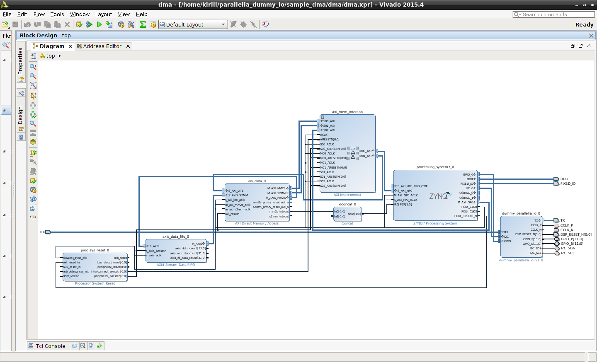

# Introduction

In this example we develop a simple Direct Memory Access (DMA) loopback
circuit using off the shelf components included in Vivado. This
circuit copies memory from one memory location to another using
Programmable Logic (PL) resources. We then demonstrate how to
interface with PL based DMA IP from Linux userspace using UIO
driver. Code samples are provided in Python.

# Prerequisites

Working installation of Vivado 2015.3 or 2015.4, preferably on a
64-bit Ubuntu 14.04, as this is what I tested with. I assume you gone
through [sample multiplier accelerator example](../sample/README.md).
I will not go into details of patching device tree as it was covered
there.

You will also need python installed on parallella, also python-numpy
package is used. On parallella board:

    sudo apt-get install python python-numpy

# Overview of the steps involved

1. Generate Vivado Project
2. Build bitstream
3. Patch Device Tree
4. Load bitstream
5. Run test python app

## Generate sample project for Vivado

There are two ways to use provided scripts

Use `gen_project.sh` to run Vivado in batch mode:

- `../scripts/gen_project.sh --bd dma_loopback --name my_test --7010`
- `../scripts/gen_project.sh --bd dma_loopback --name my_test_7020 --7020`

Invoke script from tcl shell of Vivado

    cd "path to scripts folder"
    pwd
    source proj_funcs.tcl
    mk_proj my_test 7010
    add_axi_dma_loopback ""
    make_wrapper -force -files [get_files [get_bd_designs].bd] -top -import

When this is done you can open the project in Vivado, if you used
second method it will already be open. Your block design should look
something like this:

## Build Bitstream

Assuming everything above worked fine you can now generate Bitstream.

1. Open generated project in Vivado
2. Click "Generate Bitstream"
3. Dialog will pop-up saying that synthesis and implementation need to run first, agree to that.
4. Wait for completion
5. Export Bitstream `File> Export Hardware> Export Bitstream File`
6. Save it to this folder and name it `my_dma_test.bit`

## Testing new Bitstream

We will be testing from Linux using "headless" setup provided by
Adapteva. We can swap out bitstream at run time using `/dev/xdevcfg`,
so no need to replace `parallella.bit.bin` on the sd-card just yet (or
at all). Note that since our Bitstream does not contain eLink
interface any attempt to interface with Epiphany chip will cause
kernel crash, as eLink driver tries to write to addresses that do not
exist. We will therefore need to shutdown parallella thermal service,
before loading new Bitstream for testing:

    sudo service parallella-thermald stop

For similar reasons we can not use hdmi version of the Linux, since no
hdmi related logic will be present in the bitstream we just built.

Transfer `my_dma_test.bit` to your parallella board, put it somewhere
under `$HOME`. Also copy `sample_dma` folder to parallella board.

### Patching Device Tree

Inject this into the devicetree (`pl_dma.dtsi`), follow instruction in [sample multiplier accelerator example](../sample/README.md)

    / {
    
        scratch_mem@3e000000 {
                #address-cells = <1>;
                #size-cells = <1>;
                reg = <0x3e000000 0x2000000>;
                compatible = "generic-uio";
                interrupts = < 0 58 0 >; //< Needed for older versions of uio driver, it's fake
		                         //< make sure doesn't clash with other interrupts in your design
                interrupt-parent = <0x1>;
        };
    
        amba_pl: amba_pl {
                ranges;
                #size-cells = <0x1>;
                #address-cells = <0x1>;
                compatible = "simple-bus";
    
                axi_dma_0: dma@40400000 {
                        #dma-cells = <1>;
                        compatible = "generic-uio";
                        interrupt-parent = <0x1>;
                        interrupts = <0 29 4 0 30 4>;
                        reg = <0x40400000 0x10000>;
                };
    
        };
    };

What this achieves is: we are telling UIO driver to create two UIO
devices, first device `scratch_mem` exposes reserved memory at the top
of the address range, it will be used to communicate with the PL,
second device `dma` is a control interface of the AXI DMA IP.

After updating devicetree on the boot partition you have to reboot
parallella board for changes to take place. After reboot verify that
new device tree is being used:

    dtc -I fs -O dts /proc/device-tree | grep generic-uio

Verify that UIO driver picked up our new devices:

    ls -l /dev/uio?
    ls -l /sys/class/uio/uio?/
    cat /sys/class/uio/uio?/name

### Run the Test

Load new bitstream

    # Make sure eLink is not being used
    sudo service parallella-thermald stop
    #
    # Load new Bitstream to FPGA
    sudo dd if=my_dma_test.bit of=/dev/xdevcfg

Now you can run the test

    sudo ./test_dma.py

# Under the hood

## Memory - Virtual vs Physical

First make sure you understand the difference between virtual and
physical memory, no need to have a fine grained understanding of the
interaction between linux kernel, userspace and MMU, a vague awareness
that they are not the same thing is enough.

Here is a brief, incomplete view of the world that should get you started:

1. Pointer in your C program -- that's a virtual memory address
2. Addresses listed in Vivado address editor -- that's physical memory addresses
3. Not all physical addresses are addresses of DDR memory, some are memory mapped IO, most are invalid
4. `mmap` on `/dev/uio?` or `/dev/mem` creates a mapping from physical to virtual address spaces
5. Contiguous memory chunk in your C program maybe backed by many disjoint chunks of physical memory in DDR.
6. FPGA knows nothing of virtual addresses, only speaks physical addresses

So we have a bit of a dilemma: we need physical addresses to talk to
FPGA, but we only get virtual addresses in our C program running under
Linux. We resolve this by creating a memory mapping using `mmap` on a
special device (`/dev/uio1` in this example).

By changing device tree we requested UIO driver to expose 64K of
physical address range starting at address 0x4040_0000 to any user
process who asks (so long as the process has the correct
permissions). Now when we open `/dev/uio1` device and call `mmap` on
the file descriptor we get a virtual memory address that points to
physical memory at address 0x4040_0000. We can now read and write
using virtual address pointer to a physical addresses starting from
0x4040_0000.

Similarly we created `scratch_mem` UIO device, this is a 32Mb chunk of
DDR memory at the very top of the 1G memory range. This memory is
reserved for sharing data between Epiphany chip and CPU, this is
configured in u-boot that Adapteva ships. Linux only sees 1G-32Mb of
memory, and so changing data in that range is safe, we won't
accidentally re-write some system memory. This is where we put our
test data. Using this approach is the simplest way to get a contiguous
chunk of memory and a mapping between virtual and physical memory in
the user-space program that I'm aware of. Alternative is to write
kernel driver that allocates contiguous chunk of memory on demand and
provides a `mmap` method to expose that memory to userspace program,
in a similar way that UIO driver works. There is also `/dev/mem`,
which is easier still (no need to change devicetree), but more unsafe
as the entire address space of the system is exposed to a possibly
buggy application.

## Code overview

There are three python files in this example

1. `uio.py` provides UIO class that abstracts interactions with UIO driver
2. `axidma.py` provides AxiDMA class that abstract AXI DMA IP as exposed by the UIO driver
3. `test_dma.py` ties it all together by running a simple test

UIO class provides easy access to `/dev/uio?` devices, does discovery
by name, queries all the sizes and memory ranges, calls `mmap` with
the right settings, provides virtual to physical address mapping,
allows for interrupt handling (see next section).

AxiDMA class uses UIO class to open DMA device and then abstracts
interfacing with the DMA IP. Axi DMA IP has two sub-component: MM2S
and S2MM. MM2S reads data from memory mapped device (of which DDR is
but a special case) and copies it into an AXI stream, and S2MM
consumes an AXI stream and writes it's content to a memory mapped
device or DDR. Both have identical interfaces, consisting of

1. Control register -- reset, enable, control interrupt generation logic
2. Status register
3. Address registers -- 64 bit, we only use 32 bits
4. Data size register

Basic operation is as following:

1. Reset IP to make sure it's in the right state
2. Configure address
3. Configure interrupt settings (none, on completion, on error...)
4. Write size to kick off transfer

We begin by starting S2MM transfer first (it blocks when incoming
stream is empty). We then launch MM2S transfer, this starts copying
data from DDR to AXI stream, this AXI stream is connected via FIFO to
S2MM, which in turn copies data out of PL into DDR.

You can either check status registers to see when the transfer is
finished, or, more efficiently, ask for interrupt to be generated by
the DMA IP when it's done.

Documentation for DMA core is here: http://www.xilinx.com/support/documentation/ip_documentation/axi_dma/v7_1/pg021_axi_dma.pdf

## Interrupts

Apart for providing physical<->virtual memory mapping UIO driver also
ferries interrupts from kernel into the userspace. Calling `read` on
an open file descriptor will block until interrupt is generated by the
underlying device. You have to call `read` with a buffer of size 4,
the 4 bytes returned contain a 32-bit integer counting number of
interrupts since the system start up. After each `read` interrupt
handling is disabled, to re-enable one has to `write` four bytes
containing a 32-bit value of 1 into the file descriptor.

# Next Steps

CPU off-loaded memory copy might be of some value, but there are
better ways to achieve this task on Zynq (look up pl330). The same
techniques used in this example can be applied to designs where data
is modified in some non-trivial way by the PL.

In the next installment we will look in using High Level Synthesis (HLS) to create a multiplier circuit that operates on a stream of 

# References

- http://lauri.võsandi.com/hdl/zynq/xilinx-dma.html
- http://www.fpgadeveloper.com/2014/08/using-the-axi-dma-in-vivado.html

